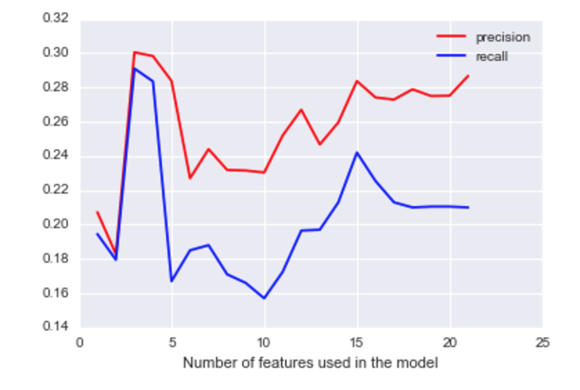
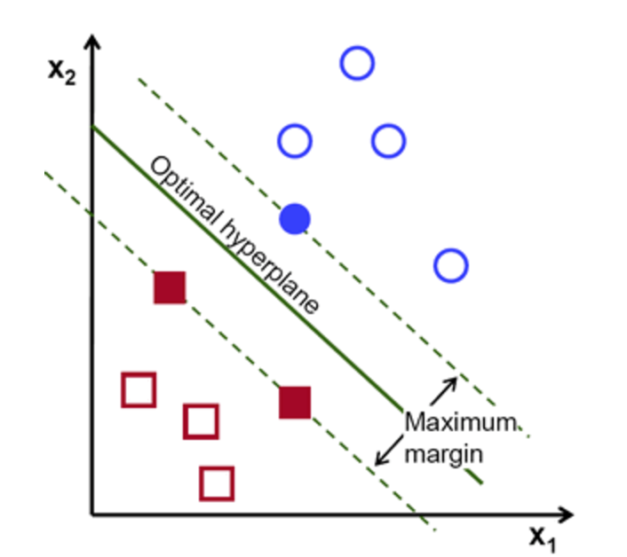
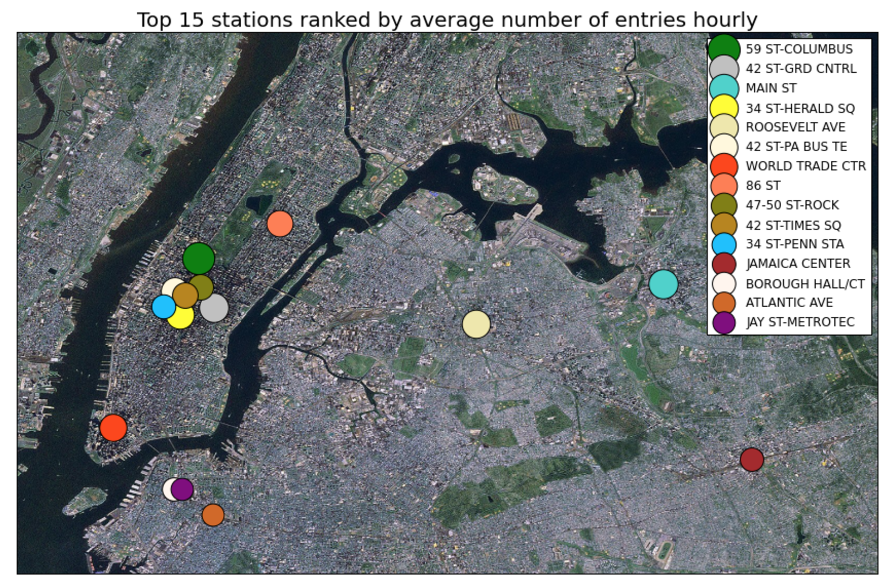
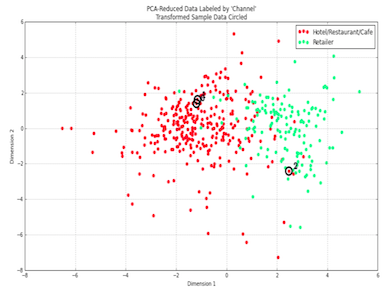
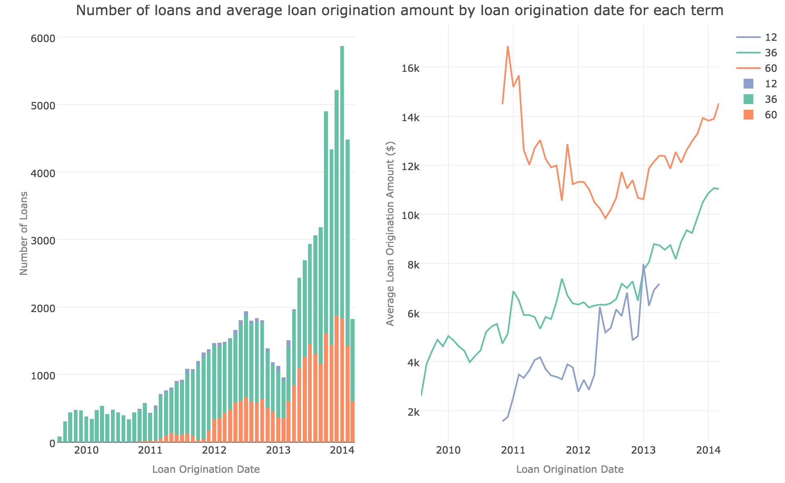

<!--html_preserve-->

  
 

  

    
Supervised Learning

    
 

    

      

        
        <a href="https://github.com/yanndupis/Identify-Fraud-from-Enron-Email" class="galleryItemLabel">Identify Fraud from Enron Email</a>
      

      

        
        <a href="https://github.com/yanndupis/Building-a-Student-Intervention-System" class="galleryItemLabel">Building a Student Intervention System</a>
      

      

        
        <a href="https://github.com/yanndupis/Analyzing-the-NYC-subway-dataset" class="galleryItemLabel">Analyzing the NYC subway dataset</a>
      

      

Unsupervised Learning

    
 

    

      

        
        <a href="https://github.com/yanndupis/Creating-Customer-Segments" class="galleryItemLabel">Creating Customer Segments</a>
      

      

Exploratory Data Analysis

    
 

    

      

        
        <a href="https://github.com/yanndupis/Exploratory-Data-Analysis-with-R-Prosper" class="galleryItemLabel">Prosper Dataset</a>
      

      

    

  

<!--/html_preserve-->